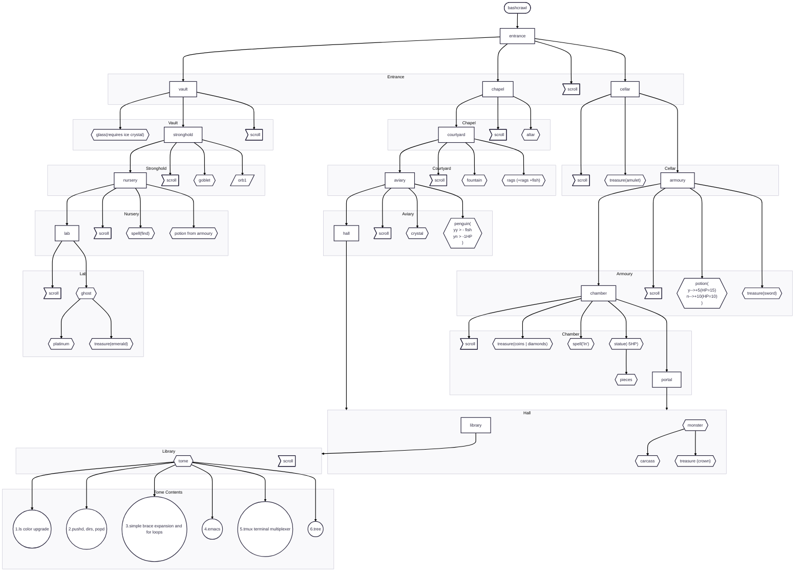

# Bash Crawl personal notes

I=crown,rags,trinket,platinum,emerald,coins,diamonds,sword,amulet,

HP=13

```mermaid
---
config:
  theme: redux
  layout: dagre
---
flowchart TD
 subgraph s1["Vault"]
        G_2{{"glass(requires ice crystal)"}}
        H["stronghold"]
        G_1>"scroll"]
  end
 subgraph s2["Cellar"]
        B_1>"scroll"]
        B_2{{"treasure(amulet)"}}
        C["armoury"]
  end
 subgraph s3["Armoury"]
        D["chamber"]
        C_1>"scroll"]
        C_2{{"potion(<br>y--&gt;+5(HP=15) <br>n--&gt;+10(HP=10)<br>)"}}
        C_3{{"treasure(sword)"}}
  end
 subgraph s4["Entrance"]
        B["cellar"]
        G["vault"]
        A_1>"scroll"]
        n18["chapel <br>"]
  end
 subgraph s5["Chamber"]
        E_1>"scroll"]
        E_2{{"treasure(coins | diamonds)"}}
        E_3@{ label: "spell('ln')" }
        E_4{{"statue(-5HP)"}}
        E_4_1{{"pieces"}}
        E["portal"]
  end
 subgraph s6["Hall"]
        F["library"]
        E_5{{"monster"}}
        n34{{"carcass <br>"}}
        n35{{"treasure (crown)"}}
  end
 subgraph s7["Library"]
        F_1{{"tome"}}
        F_2>"scroll"]
  end
 subgraph s8["Tome Contents"]
        F_1_1(("1.ls color upgrade"))
        F_1_2(("2.pushd, dirs, popd"))
        F_1_3(("3.simple brace expansion and for loops"))
        F_1_4(("4.emacs"))
        F_1_5(("5.tmux terminal multiplexer"))
        F_1_6(("6.tree"))
  end
 subgraph s9["Stronghold"]
        n1["nursery <br>"]
        n6>"scroll"]
        n7{{"goblet <br>"}}
        n8[/"orb1 <br>"/]
  end
 subgraph s10["Nursery"]
        n9["lab <br>"]
        n10>"scroll"]
        n11{{"spell(find) <br>"}}
        n13{{"potion from armoury <br>"}}
  end
 subgraph s11["Lab"]
        n14>"scroll"]
        n15{{"ghost <br>"}}
        n16{{"platinum <br>"}}
        n17{{"treasure(emerald)"}}
  end
 subgraph s12["Chapel"]
        n19["courtyard <br>"]
        n20>"scroll"]
        n21{{"altar <br>"}}
  end
 subgraph s13["Courtyard"]
        n22["aviary <br>"]
        n23>"scroll"]
        n27{{"fountain <br>"}}
        n25{{"rags (+rags +fish)"}}
  end
 subgraph s14["Aviary"]
        n30["hall <br>"]
        n31>"scroll"]
        n32{{"crystal <br>"}}
        n33{{"penguin(<br>yy &gt; - fish<br>yn &gt; -1HP<br>)"}}
  end
    start(["bashcrawl"]) --> A["entrance"]
    A ---> B & G
    A --> A_1 & n18
    B ---> C
    B --> B_1 & B_2
    C ---> D
    C --> C_1 & C_2 & C_3
    D --> E_1 & E_2 & E_3 & E_4
    E_4 --> E_4_1
    D ---> E
    F_1 --> F_1_1 & F_1_2 & F_1_3 & F_1_4 & F_1_5 & F_1_6
    G --> G_1 & G_2 & H
    H --> n1 & n6 & n7 & n8
    n1 --> n9 & n10 & n11 & n13
    n9 --> n14 & n15
    n15 --> n16 & n17
    n18 --> n19 & n20 & n21
    n19 --> n22 & n23 & n27 & n25
    n22 --> n30 & n31 & n32 & n33
    n30 --> s6
    E --> s6
    E_5 --> n34 & n35
    F --> s7
    E_3@{ shape: hexagon}
    n1@{ shape: rect}
```
