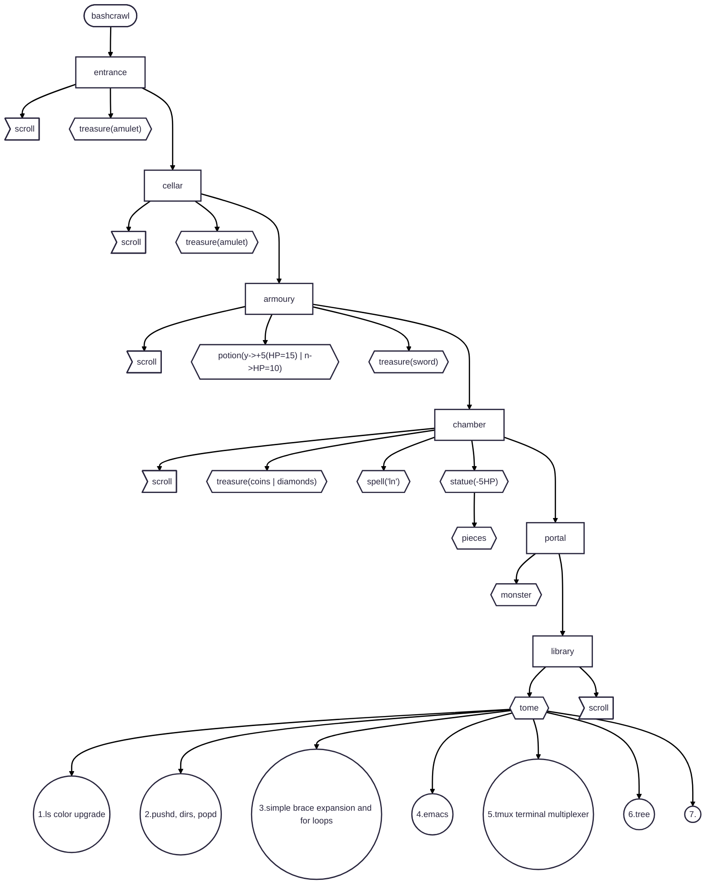

# Bash Crawl personal notes

I=coins,diamonds,sword,amulet,

HP=15

```mermaid
---
config:
      theme: redux
---
flowchart TD
        start(["bashcrawl"])
        start-->A["entrance"]
        A--->B["cellar"]
        A-->A_1>"scroll"]
        A-->A_2{{"treasure(amulet)"}}
        B--->C["armoury"]
        B-->B_1>"scroll"]
        B-->B_2{{"treasure(amulet)"}}
        C--->D["chamber"]
        C-->C_1>"scroll"]
        C-->C_2{{"potion(y->+5(HP=15) | n->HP=10)"}}
        C-->C_3{{"treasure(sword)"}}
        D-->E_1>"scroll"]
        D-->E_2{{"treasure(coins | diamonds)"}}
        D-->E_3{{"spell('ln')"}}
        D-->E_4{{"statue(-5HP)"}}-->E_4_1{{"pieces"}}
        D--->E["portal"]
        E--->F["library"]
        E-->E_5{{"monster"}}
        F-->G_1{{"tome"}}
        G_1-->G_1_1(("1.ls color upgrade"))
        G_1-->G_1_2(("2.pushd, dirs, popd"))
        G_1-->G_1_3(("3.simple brace expansion and for loops"))
        G_1-->G_1_4(("4.emacs"))
        G_1-->G_1_5(("5.tmux terminal multiplexer"))
        G_1-->G_1_6(("6.tree"))
        G_1-->G_1_7(("7."))
        F-->G_2>"scroll"]
```
